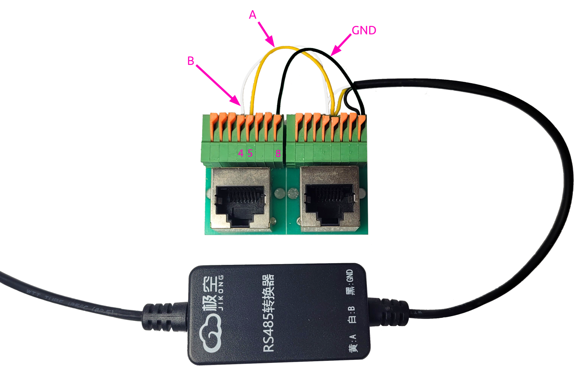

# YamBMS - JK-B BMS

[](https://www.gnu.org/licenses/gpl-3.0)
[](https://github.com/Sleeper85/esphome-yambms/releases/latest)


## JK-B BMS overview

### UART1 (GPS) port

The `GPS` port sometimes called `RS485` is not an `RS485` port but `3V3 UART-TTL` port.

```
# UART-TTL GPS port on JK-BMS (4 pin, JST 1.25mm pitch)
┌─── ─────── ────┐
│                │
│ O   O   O   O  │
│GND  RX  TX VBAT│ 
└────────────────┘
  │   │   │   └ VBAT is full battery volatge eg. 56V (possible to use it via an isolated DC-DC converter)
  │   │   └──── TX  to TTL-isolator AI (input)
  │   └──────── RX  to TTL-isolator AO (output)
  └──────────── GND to TTL-isolator GND
```

The `UART1` (labeled as `GPS`) socket of the BMS can be attached to any UART pins of the ESP32.<br>
A hardware UART should be preferred because of the high baudrate (115200 baud).<br>
The connector is called 4 pin JST with 1.25mm pitch.


## JK-B BMS protocol

Historically it was not possible to change the protocol of the `UART1 (GPS)` port and the protocol used was `4G-GPS Remote module Common protocol V4.2` with the component [esphome-jk-bms](https://github.com/syssi/esphome-jk-bms) of [@syssi](https://github.com/syssi).

If you cannot change the protocol of the `UART1 (GPS)` port you can only monitor one BMS per UART port of the ESP32, so a maximum of `3x BMS` without adding a UART expander.

If you have a recent BMS, it is now possible to change the protocol of the `UART1 (GPS)` port and with the `JK BMS RS485 Modbus V1.0` protocol you can assign an address (via JK app) to your BMS and monitor several of them from a single `UART-RS485` connection in the same way as the [JK-PB](BMS_JK-PB.md). To use this protocol and monitor all your BMS on a single `RS485 bus` you will need to add the `UART to RS485 adapter` sold by JK or another RS485 board of your choice.




## Schematic and setup instructions

> [!CAUTION]
> The `GND` of the `JK-B GPS port` is directly connected with the `B-` of your battery. Even if your BMS is in protection or stopped you can measure the `full voltage` between this `GND` and `B+`. This therefore presents a risk of `bypass` of the BMS `P-` and can be dangerous if the GND of your ESP32 is connected to the GND of your inverter or a measurement shunt for example.
> I therefore strongly advise you to achieve galvanic isolation between your ESP32 and the `UART-TTL` of the `JK-B GPS port`.

## Galvanic isolation of the `UART-TTL` connection

> [!CAUTION]
> [Please read this page about setting up galvanic isolation of the `UART-TTL` connection.](Galvanic_isolation.md)

### Atom S3 (ESP32-S3)

> [!CAUTION]
> The diagram below does not show the galvanic isolation of the `UART-TTL` connection !

The GPIOs are preconfigured in the `packages/board/board_atom-s3-lite.yaml` file.<br>
You need to import this YAML into the main YAML.

```
              UART-TTL               RS232-TTL                   CAN BUS
┌──────────┐            ┌──────────┐             ┌────────────┐              ┌──────────┐
│          │<TX------RX>│1        5│<TX-------TX>|            |              |          |
│  JK-BMS  │<RX------TX>│2        6│<RX-------RX>| CA-IS3050G |<---CAN H --->| Inverter |
│          │<----GND--->│   ESP32  │             |    CAN     |<---CAN L --->|          |
│          │     5V---->│5V     3V3|             |            |              |          |
└──────────┘            └──────────┘             └────────────┘              └──────────┘

```

### Atom Lite (ESP32-PICO)

> [!CAUTION]
> The diagram below does not show the galvanic isolation of the `UART-TTL` connection !

The GPIOs are preconfigured in the `packages/board/board_atom-lite.yaml` file.<br>
You need to import this YAML into the main YAML.

```
              UART-TTL               RS232-TTL                   CAN BUS
┌──────────┐            ┌──────────┐             ┌────────────┐              ┌──────────┐
│          │<TX------RX>│32      22│<TX-------TX>|            |              |          |
│  JK-BMS  │<RX------TX>│26      19│<RX-------RX>| CA-IS3050G |<---CAN H --->| Inverter |
│          │<----GND--->│   ESP32  │             |    CAN     |<---CAN L --->|          |
│          │     5V---->│5V     3V3|             |            |              |          |
└──────────┘            └──────────┘             └────────────┘              └──────────┘

```

### Generic ESP32 DevKit V1 30 pin

> [!CAUTION]
> The diagram below does not show the galvanic isolation of the `UART-TTL` connection !

The GPIOs are preconfigured in the `packages/board/board_esp32-devkit-v1.yaml` file.<br>
You need to import this YAML into the main YAML.

```
3V3 CAN bus

              UART-TTL               RS232-TTL                 CAN BUS (3V3)
┌──────────┐            ┌──────────┐             ┌────────────┐              ┌──────────┐
│          │<TX------RX>│16      23│<TX-------TX>|            |              |          |
│  JK-BMS  │<RX------TX>│17      22│<RX-------RX>| SN65HVD230 |<---CAN H --->| Inverter |
│          │<----GND--->│   ESP32  │<----GND---->|    CAN     |<---CAN L --->|          |
│          │     5V---->│VIN    3V3│<----3V3---->|            |              |          |
└──────────┘            └──────────┘             └────────────┘              └──────────┘


5V CAN bus

              UART-TTL               RS232-TTL                 CAN BUS (5V)
┌──────────┐            ┌──────────┐             ┌────────────┐              ┌──────────┐
│          │<TX------RX>│16      23│<TX-------TX>|            |              |          |
│  JK-BMS  │<RX------TX>│17      22│<RX--4K7--RX>|  TJA1050   |<---CAN H --->| Inverter |
│          │<----GND--->│   ESP32  │<----GND---->|    CAN     |<---CAN L --->|          |
│          │     5V---->│VIN    VIN│<----5V----->|            |              |          |
└──────────┘            └──────────┘             └────────────┘              └──────────┘

```

### Schematic with addition of the UART-TTL to RS485 adapter sold by Jikong

```

              UART-TTL                  RS485              RS485-TTL              RS232-TTL                CAN BUS
┌──────────┐            ┌───────────┐           ┌────────┐           ┌─────────┐             ┌─────────┐              ┌──────────┐
│          │<----TX---->│Y    JK   Y│<A------A+>│        │<TX-----RX>│16     23│<TX-------TX>|         |              |          |
│  JK-BMS  │<----RX---->│W  RS485  W│<B------B->│ RS485  │<RX-----TX>│17     22│<RX--4K7--RX>| TJA1050 |<---CAN H --->| Inverter |
│          │<----GND--->│B Adaptor B│<---GND--->│To 3.3V │<---GND--->|         |<----GND---->|   CAN   |<---CAN L --->|          |
│          │<----VBAT-->│R          │           │        │<---3V3--->|  ESP32  |<----5V----->|         |              |          |
└──────────┘            └───────────┘           └────────┘           └─────────┘             └─────────┘              └──────────┘

```

